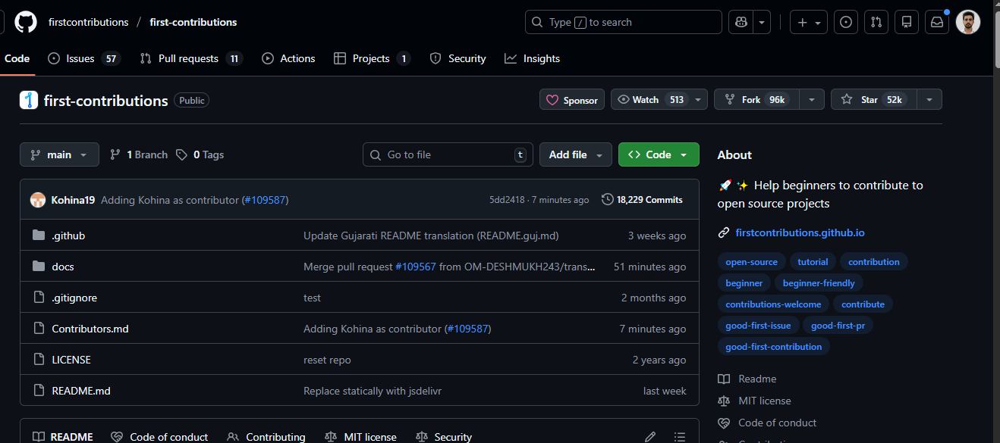
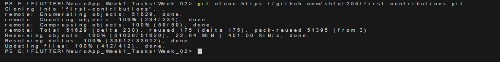
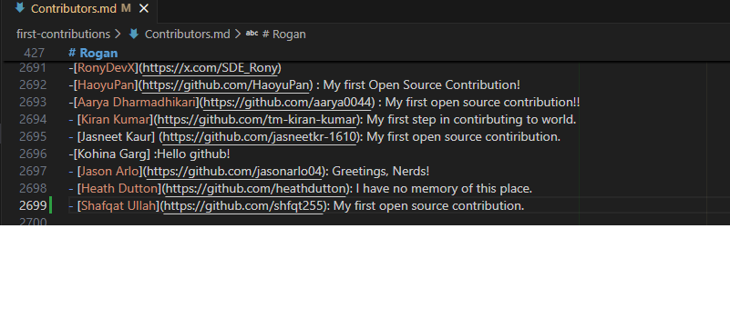
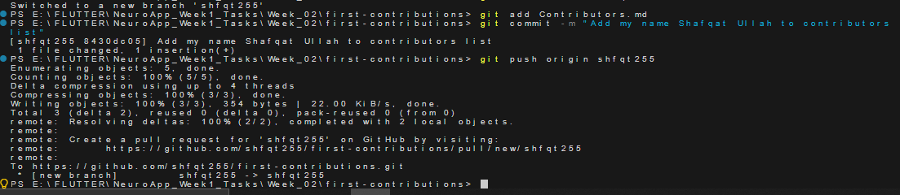
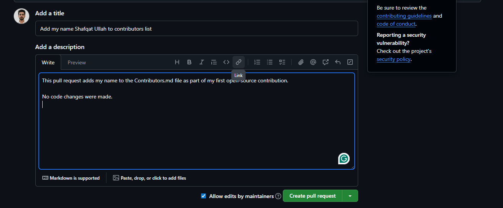
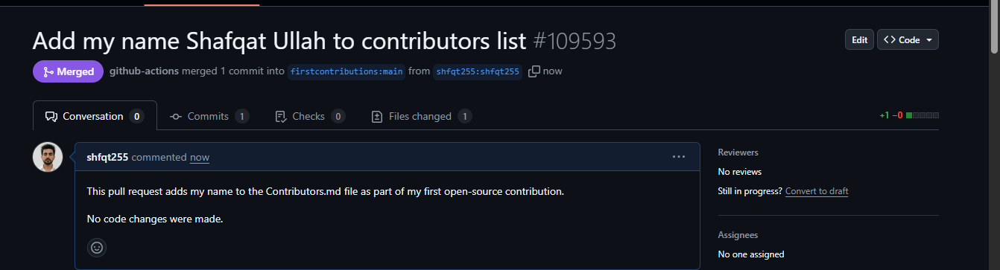

## Task 2.3 – GitHub Collaborative Workflow

This task demonstrates contributing to an open-source repository using GitHub.

### Steps Followed:
1. Forked the repository
2. Cloned the fork locally
3. Created a feature branch
4. Added my name to Contributors.md
5. Committed and pushed changes
6. Created a pull request
7. Documented the process with screenshots

### Screenshots

